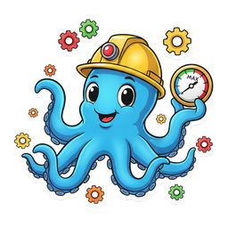
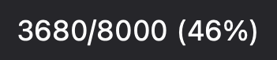
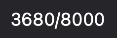
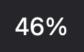
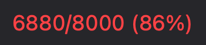

# MacOS_Process_Monitor

<p align="center"></p>

<p align="center">Part of the <a href="https://widgets.nicksmith.software">Menubarn</a> widget library.</p>


A tiny macOS menu bar app that shows the number of processes owned by the
current user and notifies when the count climbs past 85% of
`kern.maxprocperuid` — the limit that, once hit, causes `fork()` to start
returning `EAGAIN` and breaks terminals, browsers, and most apps.

Mirrors `ps -u $USER | wc -l` exactly so the menu bar number matches what you
see in a shell.

## What the menu bar shows

The status item shows your per-UID process count against the cap. The default is
text — `<count>/<limit> (<pct>%)` in monospaced digits — but the **Display**
submenu offers seven configurations: three text and four custom-drawn icons.

| Mode | `displayMode` | Menu bar |
|------|---------------|----------|
| Count / limit / pct (default) | `countTotalPct` |  |
| Count / limit | `countTotal` |  |
| Percent | `percent` |  |
| Gauge (needle) | `gauge` |  |
| Arc | `arc` |  |
| Pie | `pie` |  |
| Wedge | `wedge` |  |

Severity is colour-coded on the icon modes — green < 50%, orange < 85%, red ≥ 85%
— and the text modes turn **red** at/above the 85% threshold:

| 30% (green) | 70% (orange) | 90% (red) | text ≥ 85% |
|:-:|:-:|:-:|:-:|
|  |  |  |  |

The threshold notification has a 5pt hysteresis so a single bounce around the
limit doesn't spam alerts.

Click the icon for:

- **Sparkline** of the recent count history.
- **Crash-looping** submenu — names caught by the respawn-loop detector
  (shown only when there's something to report).
- **Top spawners** submenu — the processes spawning the most children;
  click an entry to open a floating detail window for it.
- **Open Activity Monitor** (⌘A).
- **Start at Login** toggle.
- **Quit** (⌘Q).

The detail window auto-refreshes every 2s while open and has a manual
Refresh button. There is no "Refresh now" in the main menu — the 5s polling
loop makes it redundant.

## Build

Requires Xcode command line tools (Swift 5.9+, macOS 13+).

```sh
./scripts/build-app.sh
```

Produces `build/ProcessMonitor.app`. The script wraps the Swift Package
Manager binary in a `.app` bundle and ad-hoc `codesign`s it — the signature
is required, because `UNUserNotificationCenter` silently drops notification
requests from unsigned bundles and threshold alerts won't fire.

## Run

```sh
open ~/Applications/ProcessMonitor.app
```

`~/Applications/ProcessMonitor.app` is a symlink to `build/ProcessMonitor.app`,
so rebuilds propagate without re-copying. The icon appears in the menu bar
(no Dock icon — `LSUIElement` is set).

On first launch macOS will ask for notification permission. Approve it,
otherwise the threshold alert can't fire.

## Configuration

Tunables live at the top of `Sources/ProcessMonitor/main.swift`:

- `warnPct` — threshold in percent (default `85`)
- `pollSeconds` — refresh interval in seconds (default `5`)

Rebuild after changing.

## Start at login (optional)

Use the **Start at Login** toggle in the menu. It registers the app via
`SMAppService.mainApp` (bundle-ID based) rather than a LaunchAgent —
macOS manages the lifecycle, and the app must live in `/Applications` or
`~/Applications` for registration to be accepted (which is what the
`~/Applications` symlink above provides).

Alternatively, add the app under System Settings → General → Login Items
("Open at Login"). Use one method, not both, or it may launch twice at login.

## Why not a SwiftBar plugin?

This is a standalone `.app` built on [StatusItemKit](https://github.com/nicholaspsmith/StatusItemKit), not a script under a plugin host: no SwiftBar to install, a real AppKit menu instead of rendered stdout, event-driven updates instead of a re-run timer, and an icon that keeps its place in the bar. The gauge, arc, pie and wedge icons are drawn from the live count with StatusItemKit's `MeterIcon`; a plugin could only show text or a fixed image. The full comparison is in [StatusItemKit's README](https://github.com/nicholaspsmith/StatusItemKit#why-not-swiftbar).

## The menu-bar suite

Part of a suite of macOS menu-bar apps that share one framework, one
build-and-sign script, and one installer. They are designed to sit in the
same bar together: consistent menus, a common **Icon** picker for shape and
colour, and cooperative hiding so no icon strands another.

| App | What it does |
|---|---|
| [Claude Usage](https://github.com/nicholaspsmith/claude-usage-menubar) | Claude Code plan limits, resets, and live agent sessions |
| [Apollo Monitor](https://github.com/nicholaspsmith/apollo-monitor-menubar) | Universal Audio Apollo monitor level, plus a UA process watchdog |
| [Battery Time](https://github.com/nicholaspsmith/battery-time-menubar) | Time remaining, power mode, and 24h usage |
| [VPN & DNS](https://github.com/nicholaspsmith/vpn-dns-menubar) | One dot for Mullvad + Tailscale state, with a DNS watcher |
| **Process Monitor** | Process-count sparkline against the per-UID limit |
| [KeyLight](https://github.com/nicholaspsmith/keylight-menubar) | Ctrl+brightness keys remapped to keyboard backlight |
| [MacRecorder](https://github.com/nicholaspsmith/MacRecorder) | Screen recording with system audio |
| [Media Tracking Killer](https://github.com/nicholaspsmith/media-tracking-killer-menubar) | Kills Apple's media tracking daemons |
| [Download Recycler](https://github.com/nicholaspsmith/download-recycler-menubar) | Sweeps stale files out of ~/Downloads |
| [Curtain](https://github.com/nicholaspsmith/menubar-curtain) | Hides a block of status icons by width, so it cannot strand one |

| Framework | |
|---|---|
| [StatusItemKit](https://github.com/nicholaspsmith/StatusItemKit) | Status-item lifecycle, polling, menus, meter icons, the shared Icon picker |
| [HotkeyKit](https://github.com/nicholaspsmith/HotkeyKit) | CGEventTap engine for intercepting and remapping global keys |

Install the whole suite on a fresh Mac with
[macOS Dev Environment Setup](https://github.com/nicholaspsmith/MacOS-Dev-Environment-Setup):

```bash
git clone https://github.com/nicholaspsmith/MacOS-Dev-Environment-Setup.git
cd MacOS-Dev-Environment-Setup && ./bootstrap.sh --all
```
